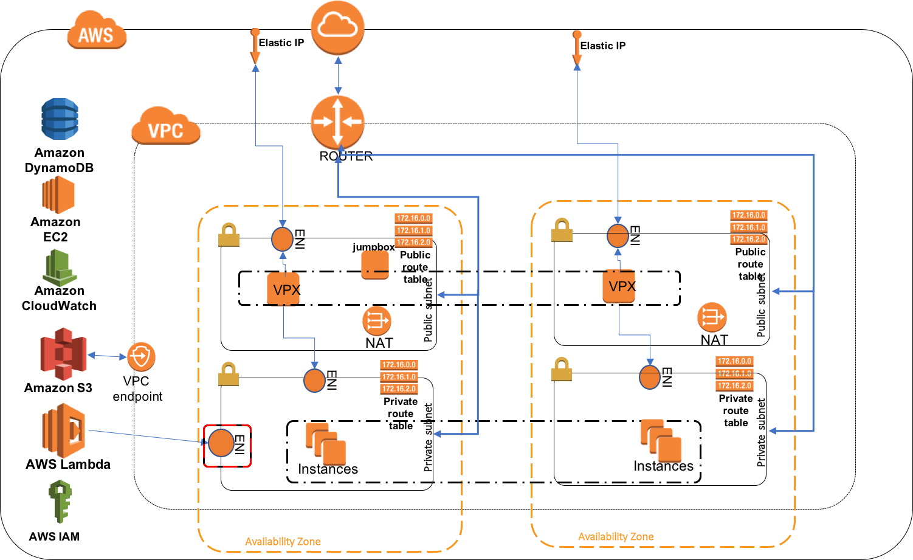

# Modular Terraform config for a complete AWS VPX deployment
This folder contains a modularized terraform config to deploy a fully AWS stack that is load balanced by a VPX.
Components of the config are:

* VPC in one or more availability zones (variable `num_azs` to control this)
    - one public subnet per AZ
    - one private subnet  per AZ
    - default security group. 
    - route table for public subnets
    - route table for private subnets
    - NAT Gateway per AZ

* Workload Autoscaling Group (`workload_asg.tf`) deployed in the private subnets, in the default security group. The instances are Ubuntu 16 instances with Apache2
* Autoscaled VPX deployment in the public / private subnets 
    - Launch lifecycle hook calls a lambda function that attaches additional ENIs and performs initialization on the freshly launched VPX
* Workload autoscaling Lambda function to reconfigure  VPX(s) when workload autoscaling group changes
	- Deployed in private subnet 
	- NAT Gateway allows access to all AWS services except S3
	- IAM role has policies allowing access to S3 buckets, EC2 API to read VPX and ASG configuration
	- CloudWatch events are hooked up to lambda invocation.
	- Lambda environment variables are derived from defaults or VPX config
	- DynamoDb table for Mutual exclusion
* VPC Endpoint to AWS S3, allowing workload autoscaling lambda access to S3
* A Linux jumpbox in the public subnet with security group rules allowing it access to the VPX private ENIs and ssh access from the Internet. Jumpbox has an auto-assigned public IP.
* A periodic CloudWatch event (see `invoke.tf`) that triggers the workload autoscaling ambda function every 5 minutes. This is to provoke the initial VPX LB configuration.  The periodic invocation should also take care of those scenarios where the regular lambda invocation failed due to various reasons 



# Pre-requisites
AWS account with sufficient privileges to create all the above. 
* Run `terraform get` to initialize the modules.
* Build the lambda binary and the config zip:


```
pushd .
cd ../../workload_autoscale/
make package-lambda package-config
cd ../vpx_lifecycle
make
popd

```

# Input vars
* Region
* Keypair name available in the region 
* Base name to derive names of AWS resources. Since this derives S3 bucket names, keep it short and conformant to DNS naming conventions.
* Number of AZ (`num_az`)

Example:
```
terraform apply -var 'key_name=my_us_east_1_keypair' -var 'aws_region=us-east-1' -var 'base_name=qa-staging' -var `num_az=2`
```

# Outputs
* Jumpbox public IP:
  - `terraform output jumpbox_publicip`
* List of elastic ips
* From the `vpc module` : `terraform output -module vpc`
 - `vpc_id` - does what it says on the tin
 - `private_subnets` - list of private subnet ids
 - `public_subnets` - list of public subnet ids
 - `public_route_table_ids` - list of public route table ids
 - `private_route_table_ids` - list of private route table ids
 - `default_security_group_id` - VPC default security group id string
 - `nat_eips` - list of Elastic IP ids (if any are provisioned)


# NOTES
* The resources created with this configuration will incur charges (mostly for the VPX and the NAT Gateway). 
* You may run out of Elastic IPs. Two are used per availability zone
* The username for the jumpbox is `ec2-user`. For the workload ASG instances, it is `ubuntu`. For the NetScaler instances, it is `nsroot`.

# BUGS
`terraform destroy` may hang while trying to destroy the VPC. This is because creating the lambda function automatically creates an ENI (unknown to terraform). Deleting the lambda does not delete the ENI. This may be fixed in later versions of terraform (> v0.8.1)
