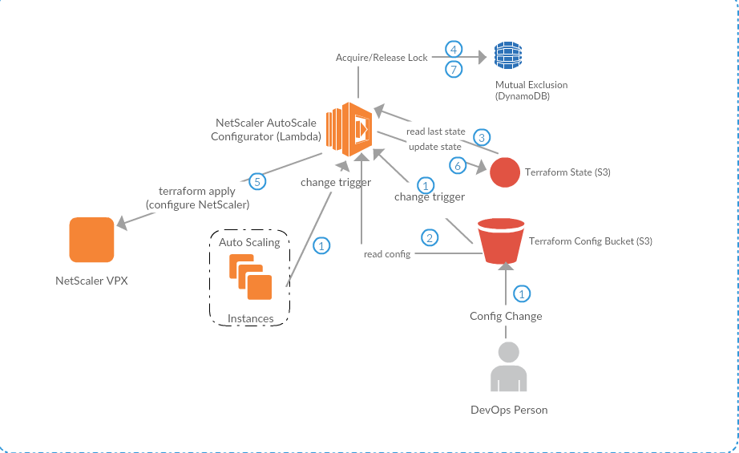

# Automate NetScaler configuration in AWS using AWS Lambda
Provides a [AWS Lambda](https://aws.amazon.com/lambda) function to manage the configuration of [Citrix NetScaler VPX instances in AWS](https://aws.amazon.com/marketplace/seller-profile?id=fb9c6078-b60f-47f6-8622-49d5e1d5aca7). The idea is to automate the reconfiguration of the NetScaler VPX when it load balances to a set of backend instances in an [AutoScaling Group (ASG)](https://aws.amazon.com/autoscaling/). As the ASG shrinks and expands, the lambda function reconfigures the NetScaler VPX appropriately.


# Theory of operation
The lambda function is bundled with a natively compiled [Terraform](https://terraform.io/) [provider](https://github.com/citrix/terraform-provider-netscaler) that can configure Citrix NetScaler using [the Nitro API](https://docs.citrix.com/en-us/netscaler/11/nitro-api.html). AWS Lambda functions can execute [natively compiled executables](https://aws.amazon.com/blogs/compute/running-executables-in-aws-lambda/). The lamdba function is configured to react to two sources of events:

* an S3 bucket that holds the terraform config file that configures the NetScaler
* Autoscaling events for the target ASG

When these events happen, the lambda function is invoked. The lambda function downloads the config file from the S3 bucket, the previous [tfstate](https://www.terraform.io/docs/state/) file from another S3 bucket and [applies](https://www.terraform.io/docs/commands/apply.html) the configuration to the NetScaler VPX. To discover the set of VPXs that it needs to configure, the lambda function searches for a particular instance tag. After successfully configuring the VPX(s), the lambda function uploads the new tfstate file to S3. Since multiple events (especially autoscale events) could happen very near each other, we have to protect from concurrent executions of the lambda instance. We use a [mutex implemented using DynamoDB](https://github.com/chiradeep/lambda-mutex)  to protect the critical section that configures the NetScaler.




# Pre-requisites

* VPC with VPC endpoint to S3
* VPC must have NAT gateway and at least 1 private subnet. Ideally the NetScaler VPX will have its own private management subnet for [NSIP address] (https://docs.citrix.com/en-us/netscaler/11/networking/ip-addressing/configuring-netscaler-owned-ip-addresses/configuring-netscaler-ip-address.html)
* An Autoscaling group in the VPC (that the VPX will loadbalance to)
* [Terraform](https://terraform.io) on your local machine to automate the deployment of the lambda function.


# Usage

## Creating the lambda function from scratch
You can deploy a sandbox VPC, VPX and autoscaling group to see the lambda function work. 
Use the Terraform config in [./setup](./setup). Or, use the Makefile

```
make  create-lambda-full

OR
make package-lambda
make package-config
cd setup; terraform get; terraform apply
```

The full terraform config expects a few  inputs such as AWS region, the name of a keypair in that region and a base name that can be prefixed to all the resources.  This can be supplied on the command line, or interactively:

```
cd setup; terraform apply 

OR
cd setup; terraform apply -var 'key_name=mykeypair_us_west_2' -var 'aws_region=us-west-2' -var 'base_name=qa-staging'

```

In addition to events from the autoscaling group and the config bucket, a scheduled event will invoke the lambda function every 15 minutes.


## Configuration of the NetScaler VPX
The Terraform config that configures the NetScaler should be in the [./config](./config) subdirectory. An example is provided. To make changes and upload the config, use

```
make update-config
```

Make sure the config bucket matches the `S3_TFCONFIG_BUCKET` enviroment variable.

```
export S3_TFCONFIG_BUCKET=$(terraform output -state=setup/terraform.tfstate -module lambda config_bucket)

```

This should upload a `config.zip` file to the S3 config bucket, which should then trigger the lambda function. Of note is the variable `vip_config` - if the terraform config has this map variable, then the key `vip` in the map will be set to the IP of the client ENI of the NetScaler.

# See it work
If everything works, then the IP of the public interface of the VPX can be retrieved:

```
vip=$(terraform output -module vpx vpx_public_ip)
```

You can see the VPX at work:

```
wget http://$vip/
```

# Workflow
Once the lambda function is created and the initial terraform config has been uploaded, the DevOps team can make changes to the config using `make update-config`. An alternative is to have a separate git repository for the config and use Git webhooks to update `config.zip` in the S3 bucket. Github webhooks can be [automated using](https://aws.amazon.com/blogs/compute/dynamic-github-actions-with-aws-lambda/) AWS lambda as well.

# Troubleshooting
Use CloudWatch logs to troubleshoot. The output of `terraform apply` is buried between the mutex acquire and release logs.
If you need detailed terraform logs, set `tf_log` in handler.py and update the lambda function.

# Development notes
You will need to set the environment variable :

```
export LAMBDA_FUNCTION_NAME=$(terraform output -state=setup/terraform.tfstate -module lambda lambda_arn)
```

Use `make update-lambda` to update the lambda function when you change the code in `handler.py`. Use `make invoke-lambda` to test the function independent of any events. 

You can also use `terraform apply` to upload new lambda code:

```
make package-lambda
cd setup
terraform apply -var 'key_name=mykeypair_us_west_2' -var 'aws_region=us-west-2' -var 'base_name=qa-staging'
```

## Testing locally
Install the `python-lambda-local` python package:

```
sudo pip install python-lambda-local
```

Find the required environment variables and export them:

```
make get-env-vars # assumes you have run the terraform in setup/ successfully
```

Export them:

```
export NSLOGIN=nsroot
...
...
```

Test:

```
make test-local
```

Note that the execution of the terraform binary will fail during local testing.

# Resources used
The monetary cost should be zero or close to it (other than the actual cost of running the VPX).

* A DynamoDB table to hold the mutex (low throughput: 2 writes/sec)
* Lambda execution. The number of executions is controlled by the number of scaling events and the number of config changes. Generally this should be in the free tier.
* S3 usage to hold the tfstate file and config file. This should be in the single-digit KB range.
* IAM permissions

# Cleanup
Use `terraform destroy` to destroy the resources created by `make create-lambda`. 

```
cd setup
terraform destroy -var 'key_name=mykeypair_us_west_2' -var 'aws_region=us-west-2' -var 'base_name=qa-staging'
```

# TODO

* Add SNS notifications on failure
* Create custom cloudwatch metrics such as number of mutex acquisition failures.

# Limitations
* Only 1 IP per NetScaler client ENI is supported. If you have secondary IPs for the Client ENI then you have to change `handler.py` and your terraform config appropriately (see `find_ns_vpx_instances()`). For example you can modify the code to read in the IP from an environment variable instead of auto-discovering it from the client ENI's primary IP.
