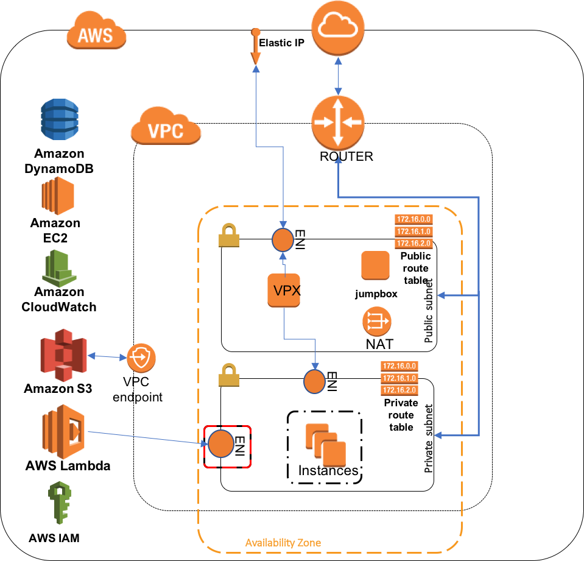

# Modular Terraform config for a complete AWS VPX deployment
This folder contains a modularized terraform config to deploy a fully AWS stack that is load balanced by a VPX.
Components of the config are:

* VPC with
    - one public subnet
    - one private subnet 
    - default security group. 
    - route table for public subnet
    - route table for private subnets
    - NAT Gateway 

* Autoscaling Group (asg) deployed in the private subnet, in the default security group. The instances are Ubuntu 16 instances with NGINX installed / running.
* VPX deployment in the public / private subnets using CloudFormation
    - NSIP ENI attached to private subnet, in the default security group
    - Server ENI attached to private subnet, in the default security group
    - Client ENI attached to public subnet 
    - Security group for Client ENI allowing public access to port 80 and 443
* Lambda function to perform autoscaling and configuration of VPX
	- Deployed in private subnet 
	- NAT Gateway allows access to all AWS services except S3
	- IAM role has policies allowing access to S3 buckets, EC2 API to read VPX and ASG configuration
	- CloudWatch events are hooked up to lambda invocation.
	- Lambda environment variables are derived from defaults or VPX config
	- DynamoDb table for Mutual exclusion
* VPC Endpoint to AWS S3, allowing lambda access to S3
* A Linux jumpbox in the public subnet with security group rules allowing it access to the VPX private ENIs and ssh access from the Internet. Jumpbox has an auto-assigned public IP.
* A periodic CloudWatch event (see `invoke.tf`) that triggers the lambda function every 5 minutes. This is to provoke the initial config of the VPX SNIP and the initial VPX LB configuration. However, the first invoke may fail since the VPX may not have completed its internal initialization. Subsequent invokes should succeed. The periodic invocation should also take care of those scenarios where the regular lambda invocation failed due to various reasons 



# Pre-requisites
AWS account with sufficient privileges to create all the above. 
* Run `terraform get` to initialize the modules.
* Build the lambda binary and the config zip:

```
pushd .
cd ../../workload_autoscale/
make package-lambda package-config
popd
```

# Input vars
* Region
* Keypair name that matches the region name
* Base name to derive names of AWS resources. Since this derives S3 bucket names, keep it short and conformant to DNS naming conventions.

Example:
```
terraform apply -var 'key_name=my_us_east_1_keypair' -var 'aws_region=us-east-1' -var 'base_name=qa-staging'
```

# Outputs
* Jumpbox public IP:
  - `terraform output jumpbox_publicip`
* VPX public IP:
  - `terraform output -module vpx vpx_public_ip`
* VPX NS IP (private):
  - `terraform output -module vpx vpx_nsip`
* From the `vpc module` : `terraform output -module vpx`
 - `vpc_id` - does what it says on the tin
 - `private_subnets` - list of private subnet ids
 - `public_subnets` - list of public subnet ids
 - `public_route_table_ids` - list of public route table ids
 - `private_route_table_ids` - list of private route table ids
 - `default_security_group_id` - VPC default security group id string
 - `nat_eips` - list of Elastic IP ids (if any are provisioned)


# BUGS
`terraform destroy` may hang while trying to destroy the VPC. This is because creating the lambda function automatically creates an ENI (unknown to terraform). Deleting the lambda does not delete the ENI. This may be fixed in later versions of terraform (> v0.8.1)

